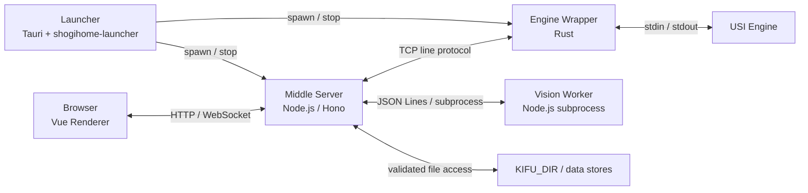
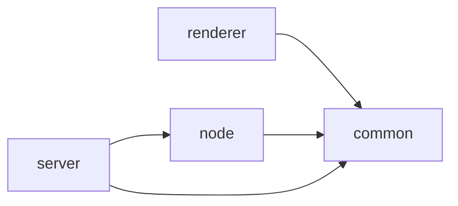

# ShogiHome Lab Architecture

この文書は、ShogiHome Lab の実行時構成、モジュール責務、信頼境界、および変更時に維持すべき設計上の不変条件を示します。個別機能の操作方法や、コードから取得できる設定値・プロトコルフィールド・UI詳細は扱いません。

## Sources of Truth

文書と実装が異なる場合は、次の実行可能な契約を優先します。

| 対象                                         | 正本                                                         |
| -------------------------------------------- | ------------------------------------------------------------ |
| モジュール責務と依存方向                     | この文書と `shogihome/eslint.config.js`                      |
| Browser と Middle Server 間の relay protocol | `shogihome/src/common/engine/relay_protocol.ts` と関連テスト |
| HTTP API                                     | `shogihome/src/server/routes/`、共有型、runtime validator    |
| 設定名・既定値・制約                         | `shogihome/src/server/config.ts`、各 `.env.example`          |
| DB schema と migration                       | `shogihome/src/server/database/` と関連テスト                |
| ビルド・配布物                               | `shogihome/scripts/`、Dockerfile、GitHub Actions workflow    |

アーキテクチャ、プロトコル、またはモジュール責務を変更する場合は、この文書と該当する詳細文書を更新します。局所的な実装変更や設定値の変更だけで、この文書へ値を複製しないでください。

## System Context

ShogiHome Lab は、PC 上の USI 将棋エンジンをブラウザーから利用する ShogiHome の派生アプリケーションです。信頼できるプライベートネットワーク内での個人利用を主な運用モデルとし、インターネットへ直接公開するサービスとしては設計していません。

実行時は次の要素から構成されます。

- **Browser**: Vue renderer を実行し、HTTP API と WebSocket を通じて Middle Server を利用します。
- **Middle Server**: Hono API、静的配信、WebSocket session、USI state machine、永続化、および外部プロセス管理を所有します。
- **Engine Wrapper**: 設定された USI engine process を起動し、TCP と stdin/stdout を中継します。Rust 実装が配布の正本です。
- **Launcher**: 配布版の常駐 UI です。Tauri shell が service 起動・停止、設定編集、移行、更新通知を提供します。`shogihome-launcher` の controller が起動・再起動・停止・移行を直列化し、状態 snapshot と稼働中の process 監視を所有します。時間のかかる IPC は UI event loop の外で実行します。
- Launcher と設定エディタは単一 Tauri アプリとして Windows／Linux／macOS で native build します。shell は app・editor・launcher・tray・shutdown に分割し、portable path、close policy、編集セッションは headless backend が所有します。
- **USI Engine**: YaneuraOu などの外部将棋エンジンです。
- **Vision Worker**: Middle Server が子プロセスとして管理する画像認識 worker です。独立サービスでも Engine Wrapper の一部でもありません。

## Runtime Topology

`shogihome/server.ts` は互換性のための薄い entry point です。サーバーの構築と起動処理は `shogihome/src/server/main.ts` が所有します。

## Component Responsibilities

| 領域                                       | 責務                                                                        |
| ------------------------------------------ | --------------------------------------------------------------------------- |
| `shogihome/src/renderer/`                  | UI、browser-local state、ユーザー操作、HTTP/WebSocket client                |
| `shogihome/src/common/`                    | Browser と Server が共有する純粋な型、codec、domain utility                 |
| `shogihome/src/node/`                      | Node.js runtime に依存する共有 utility                                      |
| `shogihome/src/server/`                    | HTTP、WebSocket、engine session、filesystem、database、worker orchestration |
| `engine-wrapper/`                          | engine 設定の読み込み、process 起動、TCP/stdio relay、process cleanup。Rust 実装（`wrapper/`）が唯一の実装。process 所有は共有 `process` crate、`.env` codec は共有 `env-file` crate に集約する |
| `engine-wrapper/launcher-app/` + `launcher/` | Tauri shell（window/tray/IPC）と `shogihome-launcher` library（supervision、設定、移行、更新、型付き `LauncherError`）。UI は process 起動や設定書き込みを直接行わない |
| `shogihome/src/server/vision/node-worker/` | 画像推論、盤面幾何処理、候補生成、診断 warning                              |

複雑な状態や business logic は UI component ではなく、renderer store、domain module、または server module が所有します。

## Module Boundaries

`shogihome/eslint.config.js` は主要な依存方向を強制します。

- `common` は `renderer`、`node`、`server` に依存しません。
- `renderer` は `node` または `server` の runtime implementation に依存しません。
- `node` は `renderer` または `server` に依存しません。
- `server` は `renderer` に依存しません。
- `shogihome/src/common/api/rpc.ts` は、Hono の `AppType` を renderer へ共有するための type-only の公式例外です。runtime dependency を追加してはいけません。

## Protocol and Trust Boundaries

境界を越える値は `unknown` として受け取り、既存の decoder、schema、path resolver を通過した後でのみ domain logic へ渡します。

| 境界                          | 所有者と検証責任                                                                                               |
| ----------------------------- | -------------------------------------------------------------------------------------------------------------- |
| Browser ↔ Server WebSocket    | `src/common/engine/relay_protocol.ts` が共有契約を所有し、renderer と server の双方が frame を decode します。 |
| Browser ↔ HTTP API            | Hono routes が body、query、session header を検証し、共有型がresponse contractを定義します。                   |
| Server ↔ Engine Wrapper       | engine session、list、auth module と Rust wrapper（`wrapper/`）が line protocol を共有します。共通 contract suite が wrapper を同一条件で検証します。 |
| Wrapper ↔ USI Engine          | Wrapper は byte/line relay と process lifecycle を担当し、USI state は解釈しません。                           |
| Server ↔ Vision Worker        | Server が JSON Lines envelope、response shape、SFEN を検証します。                                             |
| Server ↔ `KIFU_DIR`           | 集中化された path resolver が traversal、real path、symlink、extension を検証します。Browser uploadは保存名と容量を検証してatomicに公開し、directory作成は検証済みparent直下の1階層に限定します。 |
| Server ↔ external kifu source | Server が allowlist と resource limit を適用し、Browser が任意URLを直接指定できないようにします。              |

Host、Origin、body size、rate limit などのHTTP共通ポリシーは `shogihome/src/server/security.ts` と `shogihome/src/server/hono.ts` が所有します。

`KIFU_DIR` 内の atomic writer が使用する `*.lock` directory は内部専用の名前空間です。共有name validatorとpath resolverは、この名前空間へのBrowserからの作成・アクセスを拒否し、directoryとfileの一覧にも公開しません。

## Engine Session Invariants

Middle Server の `shogihome/src/server/engine/session.ts` が、engine 接続から終了までの USI state machine を一元管理します。

- Browser connection は交換可能な transport であり、論理 session と engine process の所有者は Middle Server です。
- Middle Server が `usi` / `isready` handshake、search、stop sequencing、termination を管理します。
- 思考中に新しい局面や探索要求を受けた場合、現在の探索停止が解決するまで競合する探索を開始しません。
- Engine output は対応する `position` と関連付け、古い局面の結果で現在の探索を更新しません。
- 一時的な WebSocket 切断では論理 session を保護し、同じ session ID の再接続へ状態と必要な出力を再同期できます。
- 置換済み socket の command や state frame で現在の接続を汚染しません。
- Engine Wrapper は browser session、再接続、USI state machine を所有しません。

詳細は [Remote Engine Architecture](docs/architecture/remote-engine.md) を参照してください。

## Vision Boundary

Vision scan は Middle Server が管理する worker process で実行します。

- Renderer は画像取得、曖昧な入力条件、ユーザー確認を所有します。
- Middle Server は request validation、一時ファイル、worker lifecycle、response validation、viewpoint変換を所有します。
- Worker は画像処理、ONNX inference、候補生成を所有します。
- Scan結果は確認用の一時状態であり、ユーザーが確定するまで現在の棋譜を変更しません。
- Vision処理を Engine Wrapper や USI session へ混在させません。

詳細は [Vision Architecture](docs/architecture/vision.md) を参照してください。

## Data Ownership and Persistence

| データ                  | 所有者                            | 性質                                         |
| ----------------------- | --------------------------------- | -------------------------------------------- |
| `KIFU_DIR`              | Middle Serverと外部ファイル管理者 | ユーザーが所有する棋譜・定跡・SFENの正本     |
| `data/analysis.db`      | Analysis DB module                | Engine解析結果の永続データ                   |
| `data/kifu_index.db`    | Kifu index module                 | `KIFU_DIR` から再構築可能な派生index         |
| record history / backup | History service                   | Server共有の履歴と復元データ                 |
| Book session            | Book session manager              | 保存前の変更を含む有期限の作業状態           |
| Browser storage         | Renderer                          | 端末・origin固有の設定、復元情報、接続識別子 |

Database、filesystem、browser storage は互いに代替可能な正本ではありません。特に kifu index は派生データであり、ユーザーファイルの正本として扱いません。

詳細は [Storage Architecture](docs/architecture/storage.md) を参照してください。

## Deployment Variants

- 開発時は TypeScript entry point と、必要に応じて source の Vision worker を実行します。
- 配布版は Middle Server、Vision worker、model、必要な runtime asset をビルドスクリプトで配置します。
- Engine Wrapper は Rust 版が配布の正本であり、唯一の実装です。protocol 変更時は共通 contract suite で検証します。
- 配布版の Launcher は Tauri app です。設定フォームの schema は `shogihome-launcher` の `settings` module が所有し、server / wrapper の両 `.env` を読み書きします。設定の正本は引き続き各 `.env` と `shogihome/src/server/config.ts` であり、Launcher は読み書きの bridge に留まります。
- Launcher は各 service の `.env` を別々の環境変数 snapshot として子プロセスへ渡し、同じ snapshot から readiness の host / port を決定します。ファイルにある値は継承環境より優先します。初回移行と未完了移行の再開は、server が data directory を作成する前に完了させます。
- Launcher は `ShogiHomeLab[.exe] --config-editor [--config-dir DIR]` で設定エディタ単独起動ができます。controller・dashboard・tray・service 監視は初期化せず、editor close が明示的に共通 shutdown を開始して probe cleanup 完了を待ちます。初期 window は `setup` で mode に応じて生成し、`tauri.conf.json` に静的 window は持ちません。
- `paths` module は portable root と native 実行ファイル名を一元化し、service 起動と設定編集は同じ配置契約を使います。トレイ常駐時だけ main close を hide に変換し、トレイなしでは service・probe を停止して終了します。Linux は `--tray` による opt-in、全 OS で `--no-tray` を利用できます。native／IPC の Quit は `lifecycle` の終了方針に従い、cleanup 前の終了を保留します。インストール型パッケージの保存先分離は別段階で扱います。
- Editor の設定 directory は wrapper と同じ意味の `--config-dir`（`engines.json` と `.env` の所在、相対 engine path と probe の基準）です。省略時は portable 既定 `<exe-dir>/engine-wrapper` を使います。`--config-dir` は `--config-editor` との組み合わせでのみ受け付け、通常 Launcher の supervision 対象と編集対象がずれないようにします。編集中は設定 directory 単位の OS 管理 session lock（異常終了時は自動解放）を保持し、同時編集の上書き消失を防ぎます。保存は process 単位の一意な tmp file 経由の atomic rename とします。
- Rust wrapper と launcher の probe は、親 process の終了状態とは別に POSIX process group / Windows Job Object を保持します。親の正常終了後も子孫を回収してから pipe を閉じ、Launcher の明示終了と standalone editor 終了はいずれも probe の cleanup 完了も待ちます。
- Docker構成はMiddle Serverを実行し、Engine Wrapperは別プロセスまたは別ホストで動作します。分割配置向けに wrapper + GUI のみの `engine-tools` ZIP（`ShogiHomeLab.exe`、`wrapper.exe`、`engine-wrapper/`、専用 README）も配布します。エディタは `ShogiHomeLab.exe --config-editor`、wrapper はダブルクリック（いずれも同梱の `engine-wrapper/` を既定で使用）で起動します。standalone wrapper は `<config-dir>/.env` を自動読込します（優先順位: CLI > 環境変数 > `.env` > 既定値。Launcher 経由では確定済み snapshot を渡すため `--no-env-file` で再読込を抑止します）。

正確な起動手順は [README.md](README.md)、設定は各 `.env.example`、配布構成はビルドスクリプトとrelease workflowを参照してください。

## Detailed References

- [Remote Engine Architecture](docs/architecture/remote-engine.md)
- [Launcher / Config Editor Architecture](docs/architecture/launcher.md)
- [Vision Architecture](docs/architecture/vision.md)
- [Storage Architecture](docs/architecture/storage.md)
