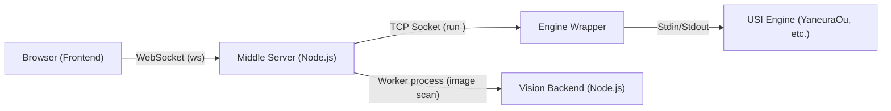

# Architecture & Implementation Details for ShogiHome Lab

このファイルは、本プロジェクトのシステム構造、ディレクトリ構成、および各機能の詳細な実装仕様を記述したドキュメントです。

## 1. アーキテクチャ概要

システムは以下の3つの主要コンポーネントで構成されています。

1.  **Frontend (`shogihome/src`)**: Vue.js 3 + TypeScript。ユーザーインターフェース。複数エンジンからID指定で起動可能。
2.  **Middle Server (`shogihome/server.ts`, `shogihome/src/server/`)**: Node.js。
    - `server.ts` は起動互換性のための薄いエントリポイントです。
    - 実装本体は `src/server/` に分割され、Hono API、セキュリティ設定、WebSocket/TCPブリッジ、USIセッション管理、Vision backend を構成します。`start_engine <id>` コマンドを Wrapper の `run <id>` へ変換。
3.  **Engine Wrapper (`engine-wrapper/`)**: Python。
    - `engines.json` に基づき、指定されたIDのエンジンプロセスを起動・中継。

## 2. 主要ディレクトリ構成

### A. Web Server & Frontend (`shogihome/`)

| パス | 説明 |
| :--- | :--- |
| `server.ts` | **サーバー起動エントリ**。既存テスト・起動コマンドとの互換性を保つため、`src/server/main.ts` の公開 API を再exportし、直接実行時にサーバーを起動します。 |
| `src/server/` | **中核サーバー実装**。Hono アプリ構築、HTTP API、静的配信、WebSocket 接続、エンジン中継ロジックを保持します。 |
| `src/server/routes/` | **HTTP API ルート定義**。棋譜、定跡、検討結果DB、履歴、外部棋譜取得、静的配信を責務別に登録します。 |
| `src/server/routes/vision.ts` | **Vision API**。画像を受け取り、Vision worker を呼び出して SFEN 候補を返します。 |
| `src/server/config.ts` | `.env` 読み込み、基準パス、ポート、許可 Origin/Host、KIFU_DIR、エンジン接続先などのサーバー設定。 |
| `src/server/security.ts` | Host ヘッダー検証、Hono secure-headers による CSP、rate limit などの HTTP/WebSocket 共通セキュリティ設定。 |
| `src/server/hono.ts` | Hono の共有型、body size limit 定数、body limit middleware factory。 |
| `src/server/bookSessionManager.ts` | Web/LAN 定跡編集用のセッション ID と内部 book session の対応、上限管理、期限切れクリーンアップ。 |
| `src/server/websocket.ts` | WebSocket サーバーの生成、Origin/Host 検証、sessionId 検証、ハートビート、セッションへの接続委譲。 |
| `src/server/engine/` | Wrapper 認証、エンジン設定キャッシュ、エンジン一覧取得、`EngineState` などのエンジン通信関連モジュール。 |
| `src/server/engine/session.ts` | WebSocket/TCP 間の USI セッション本体。エンジン起動、状態遷移、停止キュー、解析結果DB保存を管理します。 |
| `src/server/book/` | Web/LAN 定跡編集 API で使う定跡ファイル読み書き、検索、インポート処理。 |
| `src/server/helpers/` | サーバー専用の棋譜ディレクトリ操作、外部棋譜取得、LAN IP 検出、rate limit ヘルパー。 |
| `src/server/database/` | サーバー側の検討結果DBと棋譜検索インデックスDB。 |
| `src/server/kifu_index/` | `KIFU_DIR` の棋譜インデックス作成・同期処理。 |
| `src/server/file/` | サーバー側の atomic write と棋譜履歴・バックアップ永続化。 |
| `src/server/settings.ts` | サーバー/CLI で使う ShogiHome 設定ファイルの読み書き。 |
| `src/server/usi/sfen.ts` | サーバー側の SFEN 正規化と局面ハッシュ計算。 |
| `src/server/vision/` | 画像認識バックエンドの Node.js worker と呼び出しアダプタ。レスポンスの形と SFEN 妥当性を検証します。 |
| `src/common/vision/` | Vision API の共有型定義。 |
| `src/node/` | **Node 実行環境共有ユーティリティ**。server、command、旧 background から共有されるログ、実行環境パスを保持します。ブラウザー向け renderer/common からは参照しません。 |
| `src/renderer/store/index.ts` | **状態管理**。アプリ全体のステートを保持し、対局・検討・編集などの各マネージャー（`GameManager`, `ResearchManager` 等）を統合します。検討停止は `ResearchState.STOPPING` を経由する非同期ライフサイクルとして扱い、停止完了前に UI を `IDLE` 扱いしないようにしています。 |
| `src/renderer/players/lan_player.ts` | **リモートプレイヤー**。USIプロトコルの同期制御（Stop待ち、コマンド送信）を実装し、通信経由でエンジンを操作する実体です。 |
| `src/renderer/network/lan_engine.ts` | **リモートエンジン通信クライアント**。WebSocket接続とコマンド送信、エンジンリスト取得を管理。 |
| `src/renderer/view/` | **Vueコンポーネント**: |
| - `main/` | `BoardPane` (盤面), `RecordPane` (棋譜), `ControlPane` (操作パネル) など、メイン画面の構成要素。 |
| - `dialog/` | `GameDialog` (対局設定), `ResearchDialog` (検討設定), `AppSettingsDialog` (設定) など、モーダルダイアログ群。 |
| - `menu/` | `MobileGameMenu` (モバイル用メニュー) など、メニュー関連コンポーネント。 |
| `public/puzzles/` | 次の一手問題データ（JSON）。 |
| `scripts/build-puzzles.ts` | ビルド時にパズルデータを集計し、マニフェストファイルを生成するスクリプト。 |
| `docs/webapp/` | ビルド成果物 (Git管理対象外)。ライセンスファイルもここに含まれます。 |
| `.env` | 環境設定 (Git管理対象外)。ポート番号等を設定. 原本として `.env.example` を参照。 |

### B. Engine Server (`engine-wrapper/`)

| パス | 説明 |
| :--- | :--- |
| `engine_wrapper.py` | **エンジンラッパー**。エンジンをTCPサーバーとして公開するツール。エンジンオプションの注入も担当。 |
| `config_editor.py` | **設定エディタ (Backend/GUI)**。`pywebview` を使用して `config_editor.html` をデスクトップアプリとして表示し、 `engines.json` を編集するツール。 |
| `config_editor.html` | **設定エディタ (Frontend)**。単独でファイル編集ツールとしても、`config_editor.py` のUIとしても動作するハイブリッド設計。 |
| `launcher.py` | **GUIランチャー**。Webサーバーとエンジンラッパーをバックグラウンドで起動・終了する。
| `i18n.py` | **ランチャー用 i18n ヘルパー**。日本語/英語の切り替えを提供する。
| `update_checker.py` | **更新通知ロジック**。GitHub Releases API から最新版を取得し、キャッシュ・スヌーズを管理する。
| `scripts/generate_licenses.py` | Python依存ライブラリのライセンスを生成。 |
| `VERSION` | 配布パッケージに同梱されるバージョン情報。リリースワークフローで生成される（Git 管理対象外）。 |
| `engine-wrapper.mjs` | エンジンラッパー（Node.js版）。依存関係ゼロで動作する軽量な実装。 |
| `engines.json` | エンジン設定ファイル (Git管理対象外)。ID、表示名、実行パスのリストを定義。原本として `engines.json.default` (空) または `engines.json.example` (設定例) を参照。 |
| `engines.json.default` | リリース用テンプレート (空のリスト `[]`)。 |
| `engines.json.example` | 開発者向け設定例。 |
| `.env` | 環境設定 (Git管理対象外)。ポート番号等を設定. 原本として `.env.example` を参照。 |

### C. Vision Backend (`shogihome/src/server/vision/`)

本番・開発ともに Node.js 実装を標準とします。ONNX モデルは `shogihome/src/server/vision/models/` に同梱され、ビルド時に `dist/server/models/` およびリリースパッケージへコピーされます。

### C-1. Vision Backend Node Worker (`shogihome/src/server/vision/node-worker/`)

**本番運用の標準 Vision backend です**。リリースビルドでは `shogihome-server.exe` という名前の通常 Node.js runtime と `dist/server/server.js` を同梱し、同じ runtime で worker を起動します。`.env` に `VISION_ENABLED=true` のみ設定すれば有効化できます。開発時は `npm run server:build` により `dist/server/node-worker/worker.js` が生成され、未ビルド時はソースを `tsx` 経由で直接起動できます。

| パス | 説明 |
| :--- | :--- |
| `worker.ts` | **Node.js 版 Vision backend worker**。stdin/stdout の JSON Lines で `scan` リクエストを処理し、SFEN 候補 JSON を返します。 |
| `pipeline.ts` | 画像読み込み、盤面検出、透視変換、セル分割、駒認識、持ち駒認識、後処理を接続するスキャン本体。 |
| `board-detector.ts` | `board_segmenter.onnx` を使って盤面の四隅を推定します。 Douglas-Peucker による 4 点近似に失敗した場合は最小外接矩形（`minAreaRect` 相当）にフォールバックします。 |
| `board-splitter.ts` | 盤面の透視変換と 9x9 セル分割を行います。 |
| `recognizer.ts` | `mixed.onnx` で 81 マスの駒種・向きを分類します。 |
| `hand-detector.ts` | `hand_piece_detector.onnx` で持ち駒を検出します。前処理として射影変換（rectify）で持ち駒領域を長方形化します。領域サイズは盤4辺の平均長から求めたセルピクセル幅基準、ボーダー色は入力画像の平均色で埋めます。 |
| `postprocess.ts` | 認識セルから SFEN と候補を組み立て、駒数制約・二歩・行き所のない駒を検証します。 |
| `geometry.ts` | Letterbox 前処理、YOLO 出力の正規化、NMS、透視変換、画像リサンプリング、持ち駒領域の rectify（`rectifiedRegionSize` / `warpPolygonRegion` / `imageMeanColor`）などの幾何処理を提供します。 |
| `session.ts` | `onnxruntime-web` (wasm) を使って ONNX モデルを読み込み・キャッシュします。配布物には通常 wasm backend で必要な `ort-wasm-simd-threaded.mjs` と `ort-wasm-simd-threaded.wasm` のみをコピーします。 |
| `image-io.ts` | Jimp を使った画像読み込みとリサイズを行います。 |
| `types.ts` | Node worker 内部の型定義。 |

### C-2. Vision Backend Models (`shogihome/src/server/vision/models/`)

| パス | 説明 |
| :--- | :--- |
| `board_segmenter.onnx` | 盤面領域検出用 YOLO モデル。 |
| `mixed.onnx` | 81 マスの駒種・向き分類モデル。 |
| `hand_piece_detector.onnx` | 持ち駒検出用 YOLO モデル。 |

### D. Release Assets (`assets/release/`)

| パス | 説明 |
| :--- | :--- |
| `README.txt` | 配布用パッケージに同梱される `README.txt` の原本。 |
| `shim.cs` | 配布用パッケージのルートに配置する軽量ランチャー。 |

## 3. 機能実装の詳細仕様

### リモートエンジン通信フロー
1. **リスト取得**: フロントエンドが `get_engine_list` を送信。サーバーは Wrapper から `list` コマンドで取得したデータをサニタイズ（実行パス等の機密情報を除去）した上で返却。`lan_engine.ts` 側でキャッシュされるが、必要に応じて強制更新可能。
2.  **起動**: フロントエンドが `start_engine <id>` を送信。**エンジンが `STARTING` または `isStopping` 状態にある間の新規起動リクエストは、競合防止のためサーバー側で拒否される。** また、`STARTING`（TCP接続中・認証中）に `stop_engine` が届いた場合は、接続処理を即座に破棄し、`run <id>` が Wrapper に送られないようにしています。
3.  **ハンドシェイク**: `src/server/engine/session.ts` のエンジンセッションが Wrapper 接続時に `usi` を自動送信し、`usiok` 受信時に `isready` を自動送信する。クライアントからの `usi`/`isready` は無視される。
4.  **同期**: 局面移動時、`lan_player.ts` は `stop` コマンドを送り、エンジンから停止対象局面の `bestmove` を受信するまで次の `position` コマンドの送信を待機する。**サーバー側で設定されたタイムアウト（デフォルト10秒、`.env` の `ENGINE_STOP_TIMEOUT_MS` で変更可能）が発生した場合は、サーバーがハングしたエンジンを強制終了してセッションをリセットし、クライアントへ通知する。これにより不整合な状態での探索開始を防止する。** サーバー側では `stop` 送信から `bestmove` 到着までの間のコマンドをキューイングし、到着後に最新の局面のみを送信（デバウンス）する。`go` は対応する最新 `position` より後に届いた場合のみ再生し、古い局面に対する探索開始を防止する。
5.  **リアルタイム更新**: サーバーはエンジン出力に SFEN を付与して返却。フロントエンドは `dispatchUSIInfoUpdate` を通じて `usiMonitor` を更新し、読み筋タブへ反映。
6.  **コマンドバリデーションと暗黙の停止**: サーバーは受信したUSIコマンドを厳格にバリデーションし、不正なコマンドを破棄します。また、思考中に `position` 等のコマンドを受信した場合は、自動的に `stop` を発行して `bestmove` を待機する「暗黙の停止」処理を行い、状態の不整合を防ぎます。
7.  **統一された状態管理**: `src/server/engine/session.ts` 内の `EngineSession` は、接続から思考・停止・終了に至るすべてのフェーズを `EngineState` で一元管理します。これにより、思考中に停止処理が走っている状態 (`STOPPING_SEARCH`) などを明確に区別し、競合状態を防止しています。`stop_engine` 後に遅延した `bestmove` が届いた場合も、`TERMINATING` を `READY` に戻さず無視することで、終了中セッションの状態汚染を防ぎます。
8.  **簡易認証 (Simple Auth)**: `engine-wrapper` と `src/server/engine/auth.ts` 間にトークンベースの認証(HMAC-SHA256 CRAM)を導入しました。
    - 双方の `.env` に `WRAPPER_ACCESS_TOKEN` を設定することで有効化されます。
    - **CRAM方式**: 平文のトークン送信を避け、リプレイ攻撃を防ぐため、Challenge-Response認証を採用しています。
        1. Wrapper -> Server: `auth_cram_sha256 <nonce>` (16進数32文字のランダムなナンス)
        2. Server -> Wrapper: `auth <digest>` (トークンを鍵、ナンスをメッセージとしたHMAC-SHA256ハッシュ)
        3. Wrapper -> Server: 検証成功なら `auth_ok`、失敗ならエラーメッセージを送信して切断。
    - トークンが未設定の場合は、従来通り認証なしで動作します（後方互換性あり）。

#### 接続の回復力 (Resilience)
- **セッション再接続**: ネットワーク瞬断やリロードに対し、`localStorage` に保存された `sessionId` を用いた再接続機能を備えています。
- **ハートビート**: クライアントは6秒ごとに `ping` を送信し、サーバーからの `pong` 応答を監視します。タイムアウトが発生した場合は接続不良と判断して再接続を試みます。
- **切断保護 (Disconnect Protection)**: 意図しない切断（`stop_engine` コマンドなしの切断）が発生した場合、サーバー側でエンジンプロセスを一定期間（デフォルト60秒、`.env` の `ENGINE_CONNECTION_PROTECTION_TIMEOUT` で設定可能）維持します。
- **自動復旧とバッファリング**: クライアントは WebSocket 切断時に指数バックオフを用いて自動的に再接続を試みます。また、切断中に送信しようとしたコマンドはクライアント側の `commandQueue` に保持され、再接続時に自動的に再送されます。バックグラウンドから復帰した際 (`visibilitychange`) には待機時間を待たずに即座に再接続を試みることで、UXを向上させています。サーバー側は切断中のエンジン出力（`info` や `bestmove`）をバッファリング（`info` はメモリ節約のため最新10件のみ保持し、バッファ全体にも上限を設定）し、再接続時にリプレイすることで状態を完全復元します。これにより、思考中の回線断でもエラーにならずに継続可能です。
- **再接続時の状態同期**: モバイル環境への最適化として、`stop` 待ち中の瞬断が発生してもエラーとせず待機を継続します。再接続時には、サーバーから送られるセッション状態（`state`）とリプレイバッファ（`bestmove`）を照合し、クライアント側の思考状態を安全に同期・解決します。もし `bestmove` が届かずにタイムアウト（5秒）した場合は、サーバー状態に基づき待機 Promise を解決、または予期せぬ終了として通知します。
- **操作の排他制御**: `LanPlayer` 内部に `async-lock` による排他制御を導入しており、不安定な通信下での操作連打による状態不整合を防止しています。
- **意図的な終了**: クライアントから `stop_engine` コマンドが送出された後の切断は「意図的な終了」とみなされ、サーバーは即座にエンジンプロセスを終了しリソースを解放します。`LanEngine.terminateEngine()` は、切断中でも短時間の再接続を試みて `stop_engine` を送信してからソケットを閉じます。終了処理中に遅延した `bestmove` などの通常エンジン出力が届いても、サーバーはクライアントへ転送せず状態を汚染しないようにしています。

### 統合ランチャー (ShogiHome Lab Launcher)
- **プロセス一括管理**: Webサーバーとエンジンラッパーをバックグラウンドで一括起動・終了。
- **タスクトレイ常駐**: ウィンドウを閉じてもトレイに常駐し、右クリックメニューから操作（Dashboard表示、設定、再起動、終了）が可能。
- **QRコード表示**: LAN内アクセス用の URL を自動生成し、スマホ等から即座にアクセスできるよう QR コードを表示。
- **ヘルスチェック**: 2秒ごとにプロセスの死活監視を行い、異常終了（クラッシュ等）時にステータスを更新。
- **ログビューア**: バックグラウンド実行中のサーバーおよびラッパーの標準出力をファイルに保存し、GUI 上で確認可能。
- **設定エディタ管理**: 「Engine Settings」ボタンからの `config_editor.py` 起動において、ポート番号の固定、多重起動防止、およびプロセスのライフサイクル（ランチャー終了時の自動停止）を完全に管理。ブラウザ上の終了操作ともUI状態を同期。
- **更新通知**: 配布パッケージ起動時に GitHub Releases API を非同期で確認し、より新しいバージョンがある場合はランチャー上部にバナーを表示。クリックでリリースページを開く。通知は 1 週間スヌーズ可能。ネットワーク/API エラー時は起動を妨げない。
- **UI 言語切り替え**: ランチャー右上のプルダウンで日本語/英語を切り替え可能。デフォルトは日本語。ただし、ランチャー UI より前に表示されるデータ引き継ぎ Messagebox は既存の日英併記を維持する。

### エンジン設定 (`engines.json`)
- **Type**: `game` / `research` / `both` を指定可能。フロントエンドはこれに基づき、対局・検討ダイアログで表示するエンジンをフィルタリングする。
- **デフォルトエンジン**: アプリ設定で「デフォルトの検討エンジン」を指定でき、設定時は検討ボタン押下時のエンジン選択ダイアログをスキップして即座に開始する。

### 次の一手問題（Puzzles）
- **データ構造**: 静的なJSONファイルとして `/public/puzzles` に配置。`puzzles-manifest.json` がエントリーポイントとなります。
- **読み込み**: `src/renderer/store/index.ts` 内の `fetchPuzzles` で処理。
    - **キャッシュ**: 初回読み込み時にメモリ上 (`cachedPuzzles`) にキャッシュします。2回目以降はキャッシュを使用しつつ、バックグラウンドで更新を確認する Stale-While-Revalidate パターンを採用しています。
- **履歴管理**: `localStorage` (`shogihome-puzzle-history`) を使用して正解済み問題のSFENと解答日時を記録します。有効期限（28日）を過ぎた履歴は自動的に削除されます。
- **出題ロジック**: 履歴に含まれる（最近解いた）問題を除外し、ランダムに出題します。
- **問題タイプ**:
    - **次の一手 (`next_move`)**: 指定された正解手と一致するか判定。
    - **形勢判断 (`evaluation`)**: 5段階の評価値（勝率）を選択肢として提示し、エンジンの評価値と比較します。

### サーバー側棋譜管理 (Server-side Kifu Management)
サーバー上の特定のディレクトリ配下にある棋譜ファイルを、ブラウザから直接読み書きできる機能です。
- **有効化**: Webサーバー側の `.env` に `KIFU_DIR` を設定することで有効化されます。未設定時はUI上の関連ボタンが非表示になります。
- **ファイル探索**: 指定されたディレクトリを再帰的にスキャンし、棋譜（`.kif`, `.kifu`, `.ki2`, `.ki2u`, `.csa`, `.jkf`）や定跡（`.db`, `.bin`, `.sbk`）、局面集（`.sfen`）を抽出します。**棋譜リストはインメモリキャッシュにより、2回目以降の取得を高速化しています。**
- **自動同期**: **`chokidar` を使用して `KIFU_DIR` を監視しており、OS（Windows/macOS/Linux）や環境に関わらず、アプリ外でファイルが追加・削除・編集された場合も自動的にキャッシュを無効化して最新の状態を反映します。**
- **HTTP API**: 読み書きには、Hono 上に構築された専用の HTTP API (`/api/kifu/...`) を使用します。
- **セキュリティ**: `resolveKifuPath` ヘルパーにより、Path Traversal 攻撃（`../../` 等）を厳格に防止しています。**また、許可された拡張子のみを操作対象とし、ディレクトリの深さ制限（最大10階層のサブディレクトリ）や最大ファイル読み込み数（100,000件）を設けることで、不正なファイル操作やリソースの過剰消費を防止しています。** さらに、既存ファイルや親ディレクトリの実体パス (`realpath`) を検証することで、シンボリックリンクや junction を経由したディレクトリ外アクセスも拒否します。
- **キャッシュ管理**: **新しい棋譜の保存 (`/api/kifu/save`) 時や、外部でのファイル変更検知時に、インメモリキャッシュを自動的にクリアします。**
- **URI スキーム**: サーバー上のファイルは `server://相対パス` という形式の URI で管理され、これに基づき `RecordManager` が保存先を自動判定します。

### 棋譜検索データベース (Kifu Database - SQLite)
`KIFU_DIR` 内の棋譜を、局面ハッシュ（Zobrist Hash）や対局者名、大会名などで高速に検索する機能です。
- **永続化アーキテクチャ**: `data/kifu_index.db` に保存されます。検討結果 DB とは分離されており、インデックスの再構築が容易です。
- **全分岐インデックス**: 対局の本譜だけでなく、検討用の分岐手順に含まれる局面もすべてインデックス化の対象となります。
- **バックグラウンド同期**:
    - **初期同期**: サーバー起動時に全ファイルをスキャンし、`mtime` と `size` を DB と比較して差分のみをインデックスします。
    - **非ブロック処理**: 1局ごとにイベントループを解放（`setImmediate`）することで、大量の棋譜をインデックス中もサーバーの応答性を維持します。
    - **リアルタイム同期**: `chokidar` 監視と連動し、ファイルの変更を検知した瞬間にインデックスを更新します。
- **検索機能**: 局面検索では、現在の盤面が含まれるすべての棋譜を一瞬でリストアップできます。キーワード検索（対局者、大会名、ファイル名）との AND 検索も可能です。
- **データ構造**:
    - `kifu_files`: メタデータ（対局者、日付等）とファイル情報を保持。
    - `positions`: 正規化SFENと64bit Zobristハッシュを保持。
    - `kifu_positions`: どの棋譜の何手目にどの局面が現れるかを管理。

### Web 棋譜取得プロキシ (Web Kifu Fetch Proxy)
ブラウザ版の CORS 制限を回避し、外部サイト（Floodgate や WCSC 等）から棋譜を取得する機能です。
- **中継処理**: サーバーがリクエストを代行。本家共通モジュールによる文字コード判定とレート制限を継承。
- **セキュリティ**: `.env` で許可されたドメイン（SSRF 対策）かつ 10MB 以下のファイルに制限。

### 盤面画像スキャン (Vision Scan API)
カメラや画像ファイルから単一画像の盤面を読み取り、局面候補として SFEN を返すためのバックエンド境界です。
- **有効化**: Webサーバー側の `.env.example` では `VISION_ENABLED=true` が既定で設定されており、`POST /api/vision/scan` が有効になります。無効化する場合は `.env` で `VISION_ENABLED` を `true` 以外に設定、または削除します。
- **入力**: フロントエンドは選択・撮影された画像を短辺 960px 以下の JPEG（quality 0.8）へ再エンコードし、EXIF/GPS などのメタデータを送信しません。API は `image/jpeg`, `image/png` の raw body を受け付けます。最大サイズは `VISION_MAX_IMAGE_MB`（デフォルト 8MB）です。
- **外部プロセス境界**: Node.js サーバーは画像を一時ファイルへ保存し、Vision backend worker を常駐プロセスとして起動します。本番では `npm run server:runtime` で生成された `shogihome-server.exe` が `dist/server/server.js` を実行し、同じ Node.js runtime で `dist/server/node-worker/worker.js` を起動します。Docker でも同じ `dist/server` 配置を使います。開発時は `dist/server/node-worker/worker.js` が優先され、未ビルドの場合は `src/server/vision/node-worker/worker.ts` を `tsx` 経由で起動します。モデルディレクトリは worker スクリプトからの相対パス `../models` で解決されます。通信は stdin/stdout の JSON Lines で、リクエストには `imagePath`、`sideToMove`、`maxCandidates` を含めます。`viewpoint` は worker へ渡さず、Node.js 側で SFEN と warning square を反転します。
- **ONNX 推論**: Vision backend は `board_segmenter.onnx` で盤面領域検出、`mixed.onnx` で 81 マスの駒種・向き分類、`hand_piece_detector.onnx` で持ち駒検出を実行します。
- **持ち駒認識**: 盤面四隅検出結果から持ち駒台 ROI を推定し、持ち駒数・駒種を検出して SFEN の持ち駒フィールドに反映します。持ち駒検出結果は盤面候補探索の駒数制約にも反映されます。
- **後処理**: 駒種ごとの上限数、二歩、行き所のない駒を常時検証します。玉数（先後各1枚）は hard 制約ではなく `KING_COUNT_INVALID` warning として返します。盤上＋持ち駒の合計が40枚でない場合は `TOTAL_PIECE_COUNT_INVALID`、各駒種が上限を超える場合は `PIECE_COUNT_INVALID` を warning として返します。旧 `--strict-piece-count` モードは廃止し、少なすぎる駒による hard filter は行いません。ビームサーチでは bounded selection を使い、全件 sort のコストを抑えています。
- **レスポンス検証**: サーバーは Vision backend の JSON 形状を検証し、返却された `sfen` と候補 SFEN が `tsshogi` で読み込めることを確認します。不正な応答やタイムアウトは `502` として扱い、HTTP body には固定文言のみを返します。詳細な worker エラーはサーバーログへ記録します。HTTP API の安定契約は `sfen`、`confidence`、`candidates`、`warnings`、`preview` であり、worker 内部の `board` payload は API レスポンスから除外します。
- **責務分離**: ShogiVision 由来の発想（四隅検出、透視変換、81マス分類、top-k候補、後処理）は Vision backend 側に閉じ込め、Middle Server は安全なプロセス呼び出しと SFEN 検証に限定します。USI エンジン中継を担う `engine-wrapper/` には画像認識処理を混ぜません。
- **フロントエンド確認**: 画像だけでは手番や盤面の向き、局面種別（実戦/詰将棋）は確定できないため、`VisionScanDialog.vue` で `sideToMove`、`viewpoint`、`positionType` を明示指定します。スキャン中にダイアログを閉じた場合は fetch を abort し、30秒応答がない場合もタイムアウトとして中断します。読み取り結果は `VisionPositionEditDialog.vue` で確認・修正し、確定後は通常モードへ戻ります。詰将棋として取り込む場合は、編集ダイアログを開く時点で玉以外の未使用駒を後手持ち駒へ一度だけ補充します。

### 統合履歴・バックアップ管理 (Integrated History & Backup Management)
デバイスやセッションを跨いで履歴とバックアップを共有・永続化する機能です。
- **一元管理**: サーバー側で履歴を保持。本家準拠のアトミック保存と排他制御を採用。
- **永続化**: 局面変更時の自動バックアップに加え、ローカルファイルを開いた際の自動保存（サーバー転送）により、リロード後や他端末からの復元を可能にしています。

### 定跡DB管理 (Book DB Management - Web/LAN)
サーバー側の `KIFU_DIR` 内にある定跡ファイル (.db, .bin, .sbk) をブラウザから利用・編集する機能です。
- **対応形式**: YaneuraOu 形式 (`.db`)、Apery 形式 (`.bin`)、ShogiGUI/SBK 形式 (`.sbk`) をサポートします。
- **読み込み**: サーバーサイドで実行され、巨大な `.db`/`.bin` ファイルに対してはオンザフライ検索を行うことで、クライアント側のリソース消費を抑えています。SBK は protobuf ベースのバイナリ形式で、一定サイズを超える場合は Packed SFEN の索引を構築し、必要な局面だけをデコードする on-the-fly モードで扱います。現行の SBK on-the-fly は元ファイルの raw data を保持するため、`SBK_ONTHEFLY_THRESHOLD_MB` とは別に 512MiB の絶対上限を設けています。Web/LAN API ではクライアントから送信された閾値を信用せず、`.db`/`.bin` は `.env` の `ONTHEFLY_THRESHOLD_MB`、`.sbk` は `SBK_ONTHEFLY_THRESHOLD_MB` をサーバー側で適用します。
- **編集機能**: 定跡手の追加、削除、評価値/出現回数/SBK 指し手評価の更新、表示順の変更がブラウザから可能です。**「指し手追加」ダイアログにおける設定（インポート条件など）はブラウザの `localStorage` に保持されます。**
- **インポート**: サーバー上の特定の棋譜ファイルから定跡データをインポートする機能をサポートしています。
- **セキュリティ**: 棋譜管理と同様、`resolveKifuPath` によるパスバリデーションにより、安全なファイル操作を保証しています。

### エンジンごとの定跡着手 (Engine-specific Book Search - GUI Extension)
エンジン思考開始前にサーバー側の定跡を検索し、ヒットした場合は自動着手する機能です。
- **選択アルゴリズム**: USIプロトコルに準拠し、加重ランダム（定跡の着手数を考慮する）と一様ランダム（考慮しない）の2つのモードをサポート。
- **フィルタリングと高度な設定**: 先手/後手別の最小評価値、最大評価値差、最小定跡深度、定跡不使用率（一定確率で定跡を無視してエンジン探索に回す）、最大手数制限などを設定可能。
- **実装構造**: `book_search.ts` にロジックを実装。ヒット時はエンジンに探索を開始させず、UI 側で即座に着手を行う。
- **堅牢性**: サーバー側でセッション単位の定跡管理を行い、起動失敗時や終了時にはリモートエンジン接続やプロセスと合わせて、定跡リソースも確実に解放されるように設計されています。

### 検討結果データベース (Analysis Database - SQLite)
検討時のエンジン出力（USI `info` コマンドの結果）をサーバー側で永続化し、局面ごとに過去の解析結果を再利用できる機能です。
- **永続化アーキテクチャ**: Node.js v24+ の `node:sqlite` (SQLite 3) を使用。`data/analysis.db` に保存されます。
- **保存パスの最適化**: 検討結果保存で使用する主要な SQL 文は DB 初期化時に prepared statement として構築し、`bestmove` ごとの保存では再利用します。これにより、頻繁な保存時の SQL コンパイルを抑えています。
- **データ構造 (3テーブル構成)**:
    - `positions`: 正規化SFENと64bit Zobristハッシュ（`BigInt`）を保持。
    - `engines`: エンジン識別キー（`engines.json` の `analysisDBGroupId` または `id`）と表示名を保持。
    - `analysis_results`: 局面・エンジン・MultiPVを主キーとした解析結果（評価値、深さ、読み筋等）。
- **エンジンのグループ化と保存オプション**:
    - **グループ化**: `engines.json` で `analysisDBGroupName` (および内部的な `analysisDBGroupId`) を設定することで、複数のエンジン設定をDB上で単一の「論理エンジン」として集約できます。同一局面でデータが衝突した場合は、より探索深度（`depth`）が深い方のレコードが優先して保持されます。
    - **保存スキップ**: 特定のエンジンに対して `skipAnalysisDB: true` を設定することで、そのエンジンの解析結果をDBに記録しないように制御可能です。
- **正規化SFENと衝突防止**: 局面の同一性判定には手数（move count）を除いたSFENを使用します。64bit Zobristハッシュで高速に検索しつつ、取得・保存時にフルSFEN文字列を照合することで、ハッシュ衝突によるデータの誤認を完全に防止しています。
- **管理ツールと統合機能**:
    - **管理UI**: エンジンごとの統計表示、データの削除、および探索深さに基づく一括クリーンアップが可能です。
    - **データの統合 (Migration)**: 設定エディタでのグループ化設定に基づき、過去に個別IDで蓄積されたデータを新しいグループIDへ安全に移行・統合する機能を備えています。
    - **定跡エクスポート**: 蓄積したデータをやねうら王形式（.db）でエクスポートできます。ファイルはサーバーの `KIFU_DIR` に保存されます。
- **設定**: 自動検索のON/OFF、および表示する読み筋の最大手数をアプリ設定からカスタマイズ可能です。
- **表示整形の共通化**: DB タブとライブのエンジン解析表示は、同じ PV 整形ヘルパーを共有し、読み筋の手数制限と省略記号の付与ルールを統一しています。

### モバイル最適化
- **CSS**: ブラウザのツールバーによる表示崩れを防ぐため、`100vh` ではなく `100dvh` を使用しています。
- **ダイアログ**: 画面幅に応じた要素の折り返しとサイズ調整を行い、モバイルでの操作性を向上させています。
