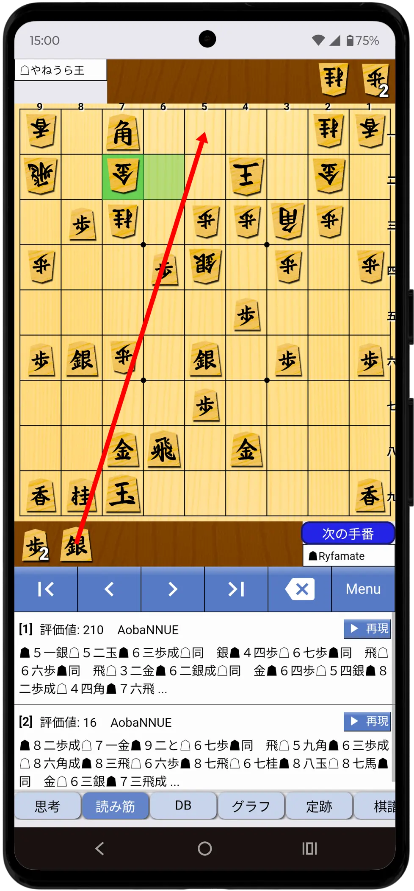
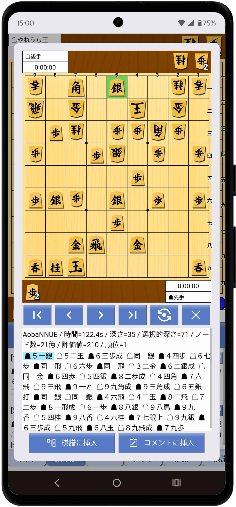
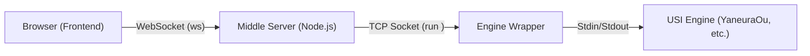

# ShogiHome Lab

[](https://github.com/yoset77/shogihome-lab/blob/main/AGENTS.md)
[](https://github.com/yoset77/shogihome-lab/actions/workflows/test.yml)

[ShogiHome](https://github.com/sunfish-shogi/shogihome) をフォークし、サーバーサイドでUSIエンジンを実行する機能を追加した改造版です。  
PC上のUSI将棋エンジンをスマートフォンやタブレットからWebブラウザ経由で利用し、ShogiHomeの快適なUIで局面の検討や対局を行うことができます。

> **セキュリティに関する注意**
> 
> 本アプリケーションは、**信頼できるプライベートネットワーク（自宅のWi-FiやVPN内など）での個人利用**を前提に設計されています。
> ポート開放を行ってインターネットに直接公開することは推奨しません。外出先からの利用にはVPN（Tailscale等）をご利用ください。

## スクリーンショット
<table>
  <tr>
    <td align="center">
      
    <br>
     <em>検討画面</em>
    </td>
    <td align="center">
      
    <br>
     <em>PVプレビュー画面</em>
    </td>
  </tr>
</table>

## 主な機能

- **エンジン対局・検討:** PC上の強力なUSIエンジンを、スマホやタブレットのブラウザから利用できます。
- **セッション継続機能:** ネットワークの一時的な切断が発生しても、サーバー側でエンジンプロセスを一定時間（デフォルト60秒）維持し、再接続時に状態を復元します。クライアント側で切断を検知した場合は自動で再接続を試みます。
- **思考結果データベース:** 検討・対局時の評価値や読み筋をサーバー側（SQLite）に自動蓄積します。思考結果は、別の棋譜やデバイスでその局面を表示した際にも即座に参照できます。
- **サーバー側棋譜・定跡管理:** サーバー上の特定のディレクトリにある棋譜・定跡ファイルを、スマホやタブレットから閲覧・編集することができます。棋譜ファイルは、局面やヘッダー情報で検索することも可能です。
- **次の一手問題:** SFEN形式の局面データをJSONファイルとして配置することで、アプリ上で次の一手問題を出題・解答できます。

---

## ディレクトリ構成

本リポジトリは、以下の2つの主要なモジュールで構成されています。

- **`shogihome/`**: Webサーバーおよびフロントエンド（TypeScript/Vue.js）。
- **`engine-wrapper/`**: 将棋エンジンを制御するエンジンラッパー（Python/Node.js）。`engines.json` で複数のエンジンを管理します。

---

## 利用方法

### A. 配布パッケージ（exe）を利用する場合

[Releases](https://github.com/yoset77/shogihome-lab/releases) からWindows用のビルド済みファイルをダウンロードできます。

1. ダウンロードしたファイルを展開し、ルートディレクトリの **`ShogiHomeLab.exe`**（ランチャー）を実行すると、Webサーバーとエンジンラッパーがバックグラウンドで起動します。
2. ランチャーの「Engine Settings」をクリックして、エンジンの登録を行ってください。
3. 表示されているQRコードをスマホで読み取るか、ブラウザで `http://localhost:8140` にアクセスしてください。

詳細なセットアップ手順やトラブルシューティングについては、同梱の **[ユーザーガイド (README.txt)](./assets/release/README.txt)** を参照してください。

### B. ソースコードから実行・ビルドする場合

#### 前提条件
- **Node.js:** v24以上
- **Python:** 3.10以上

#### 1. インストール

```shell
git clone https://github.com/yoset77/shogihome-lab.git
cd shogihome-lab
```

#### 2. Webサーバー (shogihome) のセットアップ

```shell
cd shogihome
npm ci

# 設定ファイルの作成
cp .env.example .env
# .env を編集して PORT=8140 等を設定

# フロントエンドのビルド
npm run build
```

#### 3. エンジンラッパー (engine-wrapper) のセットアップ

```shell
cd engine-wrapper
uv sync
cp .env.example .env

# 設定ツールの起動
uv run config_editor.py
# エンジンの登録と設定
```

#### 4. サーバーの起動

**Webサーバー:**
```shell
cd shogihome
npm run server:start
```

**エンジンラッパー:**
```shell
cd engine-wrapper
uv run engine_wrapper.py
# または
npm run start
```

### C. Docker を利用する場合 (Webサーバーのみ)

`shogihome/` (Webサーバー) は Docker コンテナとして実行することも可能です。

```shell
cd shogihome
cp .env.example .env
# .env の編集 (REMOTE_ENGINE_HOST 等)
docker compose up -d --build
```
※ エンジンラッパー (`engine-wrapper/`) は別途ホストマシン等で起動する必要があります。

---

## アーキテクチャ概要

本アプリケーションは、Webサーバーとエンジンラッパーの役割が分離されています。



- **エンジンラッパー (`engine-wrapper`):**
  - 将棋エンジン（`YaneuraOu`など）を管理し、TCPソケット(4082番)で待ち受けます。
  - フロントエンドからのリクエストに応じてエンジンを起動・操作します。

- **Webサーバー (`shogihome`):**
  - ブラウザ向けにShogiHomeのアプリ画面（HTML/JS）を配信します(8140番)。
  - ブラウザからのWebSocket通信を、TCP通信に変換してエンジンラッパーに中継します。

### セキュリティ機能

本アプリケーションは、以下のセキュリティ対策を実装しています。

- **USIコマンドバリデーション:** サーバー側でコマンドを検証し、コマンドインジェクションを防ぎます。
- **オリジン制限:** WebSocket接続時にオリジンを検証し、許可されたオリジン以外からの接続を拒否します。
- **HTTPヘッダー保護:** Helmetを使用し、適切なCSP (Content Security Policy) 等を設定しています。
- **エンジン接続認証:** 環境変数 (`WRAPPER_ACCESS_TOKEN`) を設定することで、Webサーバーとエンジンラッパー間の通信を認証（HMAC-SHA256）し、不正な接続を防ぐことができます。

---

## 応用

### 外部からのアクセス (VPN / PWA)

[Tailscale](https://tailscale.com/) などのVPNサービスを利用することで、外出先からもアクセスすることができます。

1.  **VPN接続:** PCとスマホをVPN（Tailscale等）で接続します。
2.  **アクセス:** スマホのブラウザから `http://[PCのIPアドレス]:8140` にアクセスします。
3.  **HTTPS化 (オプション):** `tailscale serve` などを使うことで、HTTPS化してPWAとしてインストールすることも可能です。

---

## Contribution

本プロジェクトは個人の趣味として開発されており、メンテナンスのリソースが限られています。  
そのため、**Issue や Pull Request をいただいても、対応できない場合や返信が遅れる場合があります。**
あらかじめご了承ください。

---

## Acknowledgements

ShogiHome Lab は、[Kubo Ryosuke (sunfish-shogi)](https://github.com/sunfish-shogi) 氏によって開発された [ShogiHome](https://github.com/sunfish-shogi/shogihome) をベースにしたハードフォークです。  
オリジナルの作者に深く感謝いたします。

---

## Licences

### ShogiHome Lab

[MIT License](LICENSE)

### Icon Images

[/shogihome/public/icon](https://github.com/yoset77/shogihome-lab/tree/main/shogihome/public/icon) 配下のアイコン画像は [Material Icons](https://google.github.io/material-design-icons/) を使用しています。
これには [Apache License 2.0](https://www.apache.org/licenses/LICENSE-2.0.txt) が適用されます。

### Dependencies

本ソフトウェアは多数のオープンソースソフトウェアを使用しています。詳細はアプリ内の「Third Party Libraries」画面でご確認ください。
