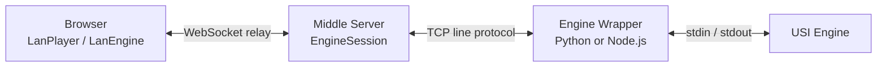

# Remote Engine Architecture

この文書は、Browser、Middle Server、Engine Wrapper、USI Engine 間の責務と、remote engine session が維持する不変条件を説明します。個別frameの完全なschemaやtimeout値は、リンク先のcodec、設定、テストを正本とします。

## Topology

Remote engine は `sessionId` で識別される論理sessionに属します。Middle Server が論理sessionとUSI state machineを所有し、WebSocketはそのsessionへ接続される交換可能なtransportです。

## Responsibilities

### Browser

- [`lan_engine.ts`](../../shogihome/src/renderer/network/lan_engine.ts) はWebSocket接続、heartbeat、再接続、送信待ちcommand、engine list cache、受信frameのdecodeを管理します。
- [`lan_player.ts`](../../shogihome/src/renderer/players/lan_player.ts) はrelayをShogiHomeのplayer interfaceへ適合させ、探索の直列化、stop待ち、局面照合、結果通知を管理します。
- Browserが保持する `sessionId` は再接続用の識別子であり、server resourceへの認証情報ではありません。

### Middle Server

- [`websocket.ts`](../../shogihome/src/server/websocket.ts) はHost、Origin、session IDを検証し、socketを論理sessionへ接続します。
- [`sessionManager.ts`](../../shogihome/src/server/engine/sessionManager.ts) は `sessionId` と [`EngineSession`](../../shogihome/src/server/engine/session.ts) の対応を管理します。
- [`session.ts`](../../shogihome/src/server/engine/session.ts) はengine起動、USI handshake、探索状態、stop sequencing、command queue、出力の局面帰属、終了、再接続bufferを所有します。
- [`list.ts`](../../shogihome/src/server/engine/list.ts) は短命なTCP接続でwrapperから設定を取得し、Browserへ公開可能なengine情報だけを返します。
- [`auth.ts`](../../shogihome/src/server/engine/auth.ts) は任意設定のwrapper challenge-response認証を実装します。

### Engine Wrapper

[`engine_wrapper.py`](../../engine-wrapper/engine_wrapper.py) と [`engine-wrapper.mjs`](../../engine-wrapper/engine-wrapper.mjs) は、同じ基本責務を持ちます。

- `engines.json` からengine定義を読み込みます。
- 必要な場合はMiddle Serverを認証します。
- Engine list要求、または指定engineのrun要求を処理します。
- Engine processを起動し、TCPとstdin/stdout間を中継します。
- 設定されたengine optionを適切な時点で注入します。
- TCP接続終了時にchild processをcleanupします。

WrapperはUSI session stateやBrowserの再接続状態を所有しません。Node.js版のprocess tree cleanupは [`shutdown-coordinator.mjs`](../../engine-wrapper/shutdown-coordinator.mjs) に分離されています。

## Lifecycle

1. Browserがengine起動を要求します。
2. Middle ServerがwrapperへTCP接続し、必要な認証後にengine runを要求します。
3. Middle Serverが `usi`、`isready` のhandshakeを進め、利用可能な状態をBrowserへ通知します。
4. Browserから受け取った検証済みUSI commandを、state machineの現在状態に従って送信または待機させます。
5. Engine outputを対応する `position` と関連付けてBrowserへ返します。
6. 明示的終了、session失効、または回復不能なengine failureでTCP接続とchild processを終了します。

Browserから送られたhandshake commandはstate machineを迂回しません。USI lifecycleの解釈はMiddle Serverに限定します。

## Search and Stop Invariants

- 1つの論理sessionは同時に複数のengine起動を進めません。
- 思考中の局面変更、再探索、option変更などは、必要に応じて先に現在の探索を停止します。
- `bestmove` または `checkmate` を待つ間に届いたcommandは直ちに競合実行せず、state machineが管理します。
- 待機commandを再生するときは、置き換えられた古い局面や探索を再開しないよう整理します。
- Engine outputは対応する `position` を伴い、rendererは現在の探索と一致しない結果を採用しません。
- Stopが回復不能な状態になった場合、未知のengine状態を継続利用せずsessionをresetします。
- 終了処理中の遅延outputでsessionを利用可能状態へ戻しません。

内部状態は [`types.ts`](../../shogihome/src/server/engine/types.ts)、外部へ公開する状態は [`relay_protocol.ts`](../../shogihome/src/common/engine/relay_protocol.ts) が定義します。両者は同一のenumではありません。

## Reconnection

再接続はBrowserとMiddle Server間のWebSocket境界に適用されます。切断したwrapper TCP接続やengine processを透明に再生成する仕組みではありません。

- Browserは一時切断時に再接続し、接続がない間のcommandを保持できます。
- 同じ `sessionId` の再接続は、保護期間内であれば既存の `EngineSession` へ接続します。
- 新しいsocketが接続されると以前のsocketを置換し、置換済みsocketからのcommandを受理しません。
- Middle Serverは切断中の必要な出力を有限のbufferへ保持し、再接続時に現在状態とともに再同期します。
- Rendererは再接続後のserver state、engine ID、terminal resultを照合し、失われたsessionを継続中と誤認しません。
- 保護期間が終了したsessionは削除され、同じIDで後から接続しても新しい未初期化sessionになります。
- 明示的closeでは、可能な範囲でengine終了要求を送ってからBrowser transportを閉じます。

## Protocol Ownership

### Browser to Middle Server

[`relay_protocol.ts`](../../shogihome/src/common/engine/relay_protocol.ts) が共有型、client/server codec、runtime validation、許可するcontrol commandとUSI commandを所有します。

Wire formatと内部のdiscriminated unionは同一表現ではありません。新しい実装がframeを独自にparseまたは構築せず、共有codecを使用してください。

### Middle Server to Wrapper

TCP protocolはWebSocket relayとは別のline-oriented contractです。次の実装を同期して変更します。

- [`session.ts`](../../shogihome/src/server/engine/session.ts)
- [`list.ts`](../../shogihome/src/server/engine/list.ts)
- [`auth.ts`](../../shogihome/src/server/engine/auth.ts)
- [`engine_wrapper.py`](../../engine-wrapper/engine_wrapper.py)
- [`engine-wrapper.mjs`](../../engine-wrapper/engine-wrapper.mjs)

### Wrapper to USI Engine

Wrapperはprocess起動、option注入、stream relay、cleanupを担当します。USI state machineはMiddle Server、renderer側の局面照合は `lan_player.ts` が担当します。
