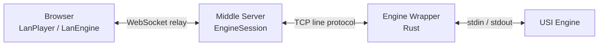

# Remote Engine Architecture

この文書は、Browser、Middle Server、Engine Wrapper、USI Engine 間の責務と、remote engine session が維持する不変条件を説明します。個別frameの完全なschemaやtimeout値は、リンク先のcodec、設定、テストを正本とします。

## Topology

```mermaid
flowchart LR
    Browser["Browser<br/>LanPlayer / LanEngine"]
    Server["Middle Server<br/>EngineSession"]
    Wrapper["Engine Wrapper<br/>Rust"]
    Engine["USI Engine"]

    Browser <-->|"WebSocket relay"| Server
    Server <-->|"TCP line protocol"| Wrapper
    Wrapper <-->|"stdin / stdout"| Engine
```

Remote engine は `sessionId` で識別される論理sessionに属します。Middle Server が論理sessionとUSI state machineを所有し、WebSocketはそのsessionへ接続される交換可能なtransportです。

## Responsibilities

### Browser

- [`lan_engine.ts`](../../shogihome/src/renderer/network/lan_engine.ts) はWebSocket接続、heartbeat、再接続、送信待ちcommand、engine list cache、受信frameのdecodeを管理します。
- [`lan_player.ts`](../../shogihome/src/renderer/players/lan_player.ts) はrelayをShogiHomeのplayer interfaceへ適合させ、探索の直列化、stop待ち、局面照合、結果通知を管理します。
- Browserが保持する `sessionId` は再接続用の識別子であり、server resourceへの認証情報ではありません。

### Middle Server

- [`websocket.ts`](../../shogihome/src/server/websocket.ts) はHost、Origin、session IDを検証し、socketを論理sessionへ接続します。
- [`sessionManager.ts`](../../shogihome/src/server/engine/sessionManager.ts) は `sessionId` と [`EngineSession`](../../shogihome/src/server/engine/session.ts) の対応を管理します。
- [`session.ts`](../../shogihome/src/server/engine/session.ts) はengine起動、USI handshake、探索状態、stop sequencing、command queue、出力の局面帰属、終了、再接続bufferを所有します。
- [`list.ts`](../../shogihome/src/server/engine/list.ts) は短命なTCP接続でwrapperから設定を取得し、Browserへ公開可能なengine情報だけを返します。
- [`auth.ts`](../../shogihome/src/server/engine/auth.ts) は任意設定のwrapper challenge-response認証を実装します。

### Engine Wrapper

Rust 実装 [`wrapper/`](../../engine-wrapper/wrapper/) が唯一の実装であり、配布の正本です。contract suite [`test_wrapper_contract.py`](../../engine-wrapper/tests/test_wrapper_contract.py) が wrapper を検証します。

- `engines.json` からengine定義を読み込みます。
- 必要な場合はMiddle Serverを認証します。
- Engine list要求、または指定engineのrun要求を処理します。
- Engine processを起動し、TCPとstdin/stdout間を中継します。
- 設定されたengine optionを適切な時点で注入します。
- TCP接続終了時にchild processをcleanupします。

WrapperはUSI session stateやBrowserの再接続状態を所有しません。relay と cleanup を単一 task で直列化し、POSIX process group / Windows Job Object で tree を回収します。Windows では `process-wrap` が suspended spawn → Job assignment → resume を行います。親の終了を観測しても tree の所有権を失わず、子孫を停止してから最終出力を期限付きで drain します。

Wrapper の `ENGINE_HIGH_QOS` は既定で無効です。有効時は Windows でエンジンを起動した直後に子プロセスのハンドルへ HighQoS を明示指定します。適用に失敗しても警告を残して中継を継続します。これは CPU affinity の固定ではなく、`cmd`／`bat` 経由では起動用プロセスに適用されるためエンジン本体には保証されません。Windows 以外では有効指定を無視して起動時に警告します。

配布版 Launcher は wrapper の `.env` の既知の設定キー（`ENGINE_HIGH_QOS` を含む）を decode して環境変数へ渡し、wrapper へは `--no-env-file` を付けて再読込による snapshot ずれを抑止します。standalone wrapper は `<config-dir>/.env` を自動読込します（優先順位: CLI > 環境変数 > `.env` > 既定値。既定で設定済みの環境変数—空文字列を含む—が `.env` より優先されます）。registry は `--config-dir`（省略時は `engines.json` のある `<exe-dir>/engine-wrapper`、なければ実行ファイルの directory）から取得します。`.env` の値はリテラルであり、`${VAR}` 展開は行いません。

エンジン側ホストでは `ShogiHomeLab[.exe] --config-editor [--config-dir DIR]` で設定 GUI のみを起動できます（controller・dashboard・service・tray なし、editor close で cleanup 後に process 終了）。Tauri shell は Windows／Linux／macOS の native build を対象とします。editor と wrapper の `--config-dir` は同じ意味（`engines.json` と `.env` の所在、相対 engine path の基準）で、probe の CWD は解決した engine の directory です。`--config-dir` は `--config-editor` との組み合わせでのみ受け付けます。編集中は設定 directory 単位の session lock を保持し、他プロセスの同時編集を拒否します。詳細は [Launcher Architecture](launcher.md) を参照してください。現行の Windows `engine-tools` ZIP はこの分割配置のための wrapper + GUI のみ配布物です。

## Lifecycle

1. Browserがengine起動を要求します。
2. Middle ServerがwrapperへTCP接続し、必要な認証後にengine runを要求します。
3. Middle Serverが `usi`、`isready` のhandshakeを進め、利用可能な状態をBrowserへ通知します。
4. Browserから受け取った検証済みUSI commandを、state machineの現在状態に従って送信または待機させます。
5. Engine outputを対応する `position` と関連付けてBrowserへ返します。
6. 明示的終了、session失効、または回復不能なengine failureでTCP接続とchild processを終了します。

Browserから送られたhandshake commandはstate machineを迂回しません。USI lifecycleの解釈はMiddle Serverに限定します。

## Search and Stop Invariants

- 1つの論理sessionは同時に複数のengine起動を進めません。
- 思考中の局面変更、再探索、option変更などは、必要に応じて先に現在の探索を停止します。
- `bestmove` または `checkmate` を待つ間に届いたcommandは直ちに競合実行せず、state machineが管理します。
- 待機commandを再生するときは、置き換えられた古い局面や探索を再開しないよう整理します。
- Engine outputは対応する `position` を伴い、rendererは現在の探索と一致しない結果を採用しません。
- Stopが回復不能な状態になった場合、未知のengine状態を継続利用せずsessionをresetします。
- 識別付き探索のstop期限はBrowser切断中も進行し、再送や再接続で延長しません。
- 終了処理中の遅延outputでsessionを利用可能状態へ戻しません。

内部状態は [`types.ts`](../../shogihome/src/server/engine/types.ts)、外部へ公開する状態は [`relay_protocol.ts`](../../shogihome/src/common/engine/relay_protocol.ts) が定義します。両者は同一のenumではありません。

## Reconnection

再接続はBrowserとMiddle Server間のWebSocket境界に適用されます。切断したwrapper TCP接続やengine processを透明に再生成する仕組みではありません。

- Browserは一時切断時に再接続し、接続がない間のcommandを保持できます。
- 同じ `sessionId` の再接続は、保護期間内であれば既存の `EngineSession` へ接続します。
- 新しいsocketが接続されると以前のsocketを置換し、置換済みsocketからのcommandを受理しません。
- Middle Serverは切断中の必要な出力を有限のbufferへ保持し、再接続時に現在状態とともに再同期します。
- Rendererは再接続後のserver state、engine ID、terminal resultを照合し、失われたsessionを継続中と誤認しません。
- 保護期間が終了したsessionは削除され、同じIDで後から接続しても新しい未初期化sessionになります。
- 明示的closeでは、可能な範囲でengine終了要求を送ってからBrowser transportを閉じます。

## Protocol Ownership

### Identified Search and Cancellation

`searchSnapshot` を受信したBrowserは識別付き探索を利用します。既存のraw USI relayは旧client/serverとの互換経路として維持しますが、snapshotを提供しないserverとの対局では「待った」を有効にしません。

- `search` はsession実体ID、単調増加する探索ID、局面、`go` 条件を一つの要求で渡します。Serverが既存USI state machineを通じて `position` と `go` に展開します。
- 同一探索IDの再送では再探索しません。直近IDで異なる条件を指定した要求は拒否します。より古いIDの要求も実行しません。
- `stopSearch` は指定探索だけを停止し、結果を利用できる通常の停止です。
- `cancelSearch` は指定ID以下を無効にする単調増加の取消境界です。待機探索を除去し、実行中ならterminal outputを待ちます。停止済みの境界はsnapshotの `settled` で確認します。
- Engine outputには局面とsession実体ID・探索IDを付けます。Browserは同一局面でも探索IDが異なる結果や、一度消費したterminal resultを採用しません。定跡HTTP応答と表示更新にもローカルな取消世代を適用します。
- `searchSnapshot` は接続時・探索状態変更時・再送要求時に最新状態から生成します。実体ID、revision、受付済み探索、取消受付・完了境界、実行中探索、直近terminal result、再接続保護期間を公開します。terminal resultは接続中に送信した後も次の探索受付まで保持し、受信未確認の通知を再同期できます。
- Snapshotは通常の出力bufferへ入れません。保持量は直近要求・実行中／待機中探索・直近結果と境界値に限定します。engine終了では実体IDを更新し、保護期間後のsession再作成でも新しい実体IDになります。
- `LanEngine` は識別付き要求をraw command queueとは分けて保持します。再接続時はsnapshotと照合した後に必要な要求だけを再送します。取消済みの未送信探索は除去し、古い取消／停止で新しい探索を停止しません。
- `LanPlayer` は接続済みsocketのsnapshotだけを状態の正本として扱います。置換済みsocketから受け取るengine outputにも探索照合を適用し、raw stateの遅延再生で現在の状態を上書きしません。

棋譜・時計の巻き戻しはBrowserの責務です。ServerとWrapperへ「何手戻すか」や対局時計を移しません。機能側の失敗・中断方針は [Takeback](../features/takeback.md) を参照してください。

### Browser to Middle Server

[`relay_protocol.ts`](../../shogihome/src/common/engine/relay_protocol.ts) が共有型、client/server codec、runtime validation、許可するcontrol commandとUSI commandを所有します。

Wire formatと内部のdiscriminated unionは同一表現ではありません。新しい実装がframeを独自にparseまたは構築せず、共有codecを使用してください。

### Middle Server to Wrapper

TCP protocolはWebSocket relayとは別のline-oriented contractです。次の実装を同期して変更します。

- [`session.ts`](../../shogihome/src/server/engine/session.ts)
- [`list.ts`](../../shogihome/src/server/engine/list.ts)
- [`auth.ts`](../../shogihome/src/server/engine/auth.ts)
- [`wrapper/`](../../engine-wrapper/wrapper/)（Rust）
- [`test_wrapper_contract.py`](../../engine-wrapper/tests/test_wrapper_contract.py)（wrapper の検証）

### Wrapper to USI Engine

Wrapperはprocess起動、option注入、stream relay、cleanupを担当します。USI state machineはMiddle Server、renderer側の局面照合は `lan_player.ts` が担当します。

境界での意図的な振る舞い（等価動作の詳細はコードと contract suite が正本）：

- Auth ダイジェストは strict 64-hex パースで fail closed する。
- エンジン最終行の末尾改行なし出力は破棄せず flush する。
- Client→engine 行は trim + UTF-8 再送出しとし、CR/LF 混入は拒否する。
- Option 値は scalar-only schema とし、不正・複合値は警告して skip する。
- エンコーディングは行単位で UTF-8 → CP932/Shift-JIS fallback → UTF-8 転送とし、engine stdin への CP932 再変換はしない。stderr は stdout 同様に転送する。
- TCP client 入力は `MAX_LINE_BYTES` を読込途中から適用する有界行読込で処理する。改行なしで上限を超えた入力は接続終了とし、spawn 済み engine は通常 cleanup で回収する。relay 中の分割・連結行や pipelining は保持する。
