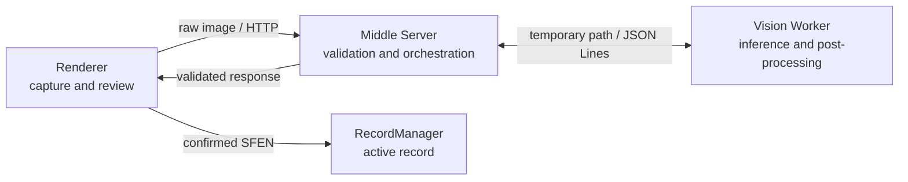

# Vision Architecture

Vision機能は画像から盤面候補を生成し、ユーザーの確認後にSFENを現在の棋譜へ取り込みます。この文書はprocess境界と責務を説明し、model設定やresource limitの具体値はコードと設定を正本とします。

## Boundaries and Ownership

- **Renderer** は画像取得・再encode、手番や視点などの入力、一時的な編集session、最終確認を所有します。
- **Middle Server** はfeature有効性、request validation、一時ファイル、worker supervision、response validation、視点変換を所有します。
- **Vision Worker** は画像decode、盤面幾何処理、ONNX inference、候補生成、score、診断warningを所有します。
- **RecordManager** はアプリケーションの現在局面を所有します。Scan結果だけでは現在の棋譜を変更しません。
- Vision処理はEngine WrapperおよびUSI engine sessionから独立しています。

公開する共有型は [`src/common/vision/types.ts`](../../shogihome/src/common/vision/types.ts) が定義します。Worker内部の中間表現は [`node-worker/types.ts`](../../shogihome/src/server/vision/node-worker/types.ts) に閉じ込めます。

## Request Flow

1. Rendererが画像と、画像だけでは確定できない入力条件を収集します。
2. Rendererは画像をdecodeして再encodeし、向きを正規化するとともに元画像のmetadataを除去します。
3. [`routes/vision.ts`](../../shogihome/src/server/routes/vision.ts) がmedia type、body、feature設定を検証します。
4. [`command.ts`](../../shogihome/src/server/vision/command.ts) が画像を分離された一時directoryへ書き、worker clientへscanを依頼します。
5. [`worker.ts`](../../shogihome/src/server/vision/worker.ts) がchild processを起動または再利用し、ID付きJSON Linesでrequestとresponseを対応付けます。
6. Workerが推論pipelineを実行し、選択候補、代替候補、confidence、warningを返します。
7. Middle Serverがresponse shapeとSFENを検証し、worker内部fieldを公開responseから除外します。
8. 必要な視点変換をMiddle Serverで適用し、Rendererへ返します。
9. Rendererが候補を編集可能な一時sessionへ保持し、ユーザーに確認を求めます。
10. 確定時に編集後SFENを再度parseし、RecordManagerを通じて現在の棋譜を置き換えます。キャンセル時は一時sessionだけを破棄します。

Viewpoint変換は推論workerではなくServer adapterの責務です。詰将棋としての取り込みなど、アプリケーション固有の編集policyはRendererが担当します。

## Worker Pipeline

[`node-worker/pipeline.ts`](../../shogihome/src/server/vision/node-worker/pipeline.ts) が次の段階を接続します。

1. **Image decode**: [`image-io.ts`](../../shogihome/src/server/vision/node-worker/image-io.ts) が画像を読み込み、処理可能な範囲へ正規化します。
2. **Board detection**: [`board-detector.ts`](../../shogihome/src/server/vision/node-worker/board-detector.ts) が盤面領域と四隅を推定します。
3. **Rectification and split**: [`board-splitter.ts`](../../shogihome/src/server/vision/node-worker/board-splitter.ts) が透視変換と81マスへの分割を行います。
4. **Board recognition**: [`recognizer.ts`](../../shogihome/src/server/vision/node-worker/recognizer.ts) が各マスの駒と向きの候補を生成します。
5. **Hand recognition**: [`hand-detector.ts`](../../shogihome/src/server/vision/node-worker/hand-detector.ts) が盤面幾何から持ち駒領域を求め、駒を検出します。
6. **Candidate assembly**: [`postprocess.ts`](../../shogihome/src/server/vision/node-worker/postprocess.ts) が制約付き候補探索、SFEN生成、ranking、warning生成を行います。

ONNX sessionは [`node-worker/session.ts`](../../shogihome/src/server/vision/node-worker/session.ts) が読み込み、worker processの生存中は再利用します。

## Validation

Model出力を信頼せず、境界ごとに検証します。

- HTTP routeは許可された画像media typeとrequest sizeを検証します。
- Image decoderは画像dimensionとresource使用量を制限します。
- 一時ファイルは固定された用途で作成し、成功・失敗にかかわらずcleanupします。
- Worker transportは既知のrequest IDを持つJSON Lines envelopeだけを受理します。
- Malformed JSON、未知のresponse、過大な出力、timeout、process failureでは現在のworkerを無効化します。
- [`schema.ts`](../../shogihome/src/server/vision/schema.ts) が公開に必要なresponse fieldを検証し、返されたSFENを `tsshogi` でparseします。
- [`transform.ts`](../../shogihome/src/server/vision/transform.ts) が公開fieldの選択と視点変換を一貫して行います。
- Post-processingの制約とwarningは候補品質を改善しますが、完全な合法局面の証明ではありません。最終判断はユーザー確認に委ねます。
- 確定したSFENもRecordManager境界で再度parseします。

## Worker Lifecycle

- Workerは最初のscan要求時に起動し、model sessionを再利用します。
- Scanは有限の待ち行列で受け付け、worker内部では競合実行させません。
- Timeout、crash、write failure、protocol violationでは影響を受けたrequestを失敗させ、child processを終了します。
- 待機中の後続requestは、新しいworkerを起動して処理を継続できます。
- Browser側のcancelとServer側のworker timeoutは別の境界です。Browser切断後もServerがworker lifecycleを確実に収束させます。
- 一時画像、Rendererのobject URL、編集sessionのBlobは、それぞれの所有者が終了時に解放します。

## Build and Deployment

[`build-server.mjs`](../../shogihome/scripts/build-server.mjs) はMiddle ServerとVision workerを別bundleとして構築し、modelと必要なruntime assetを検証して配置します。

[`build-server-runtime.mjs`](../../shogihome/scripts/build-server-runtime.mjs) は配布用Node runtimeとserver、worker、modelを組み立てます。開発時はbuilt workerがなければsourceを直接実行できますが、配布時の配置はbuild scriptを正本とします。
